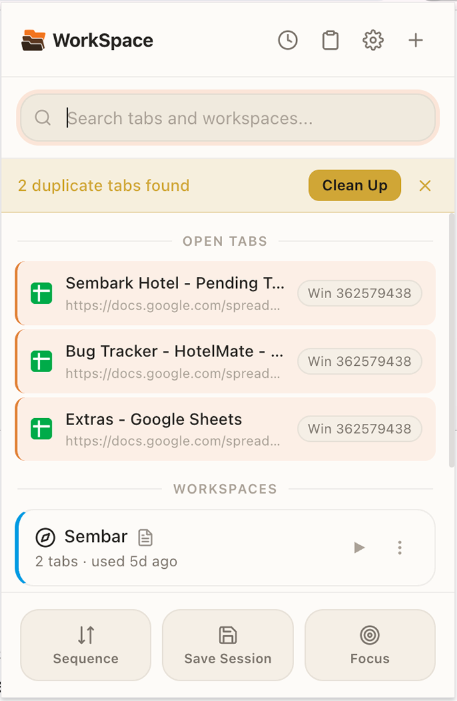
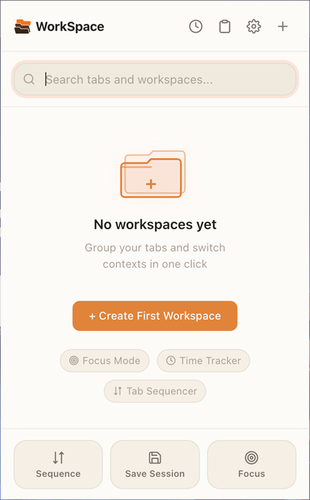
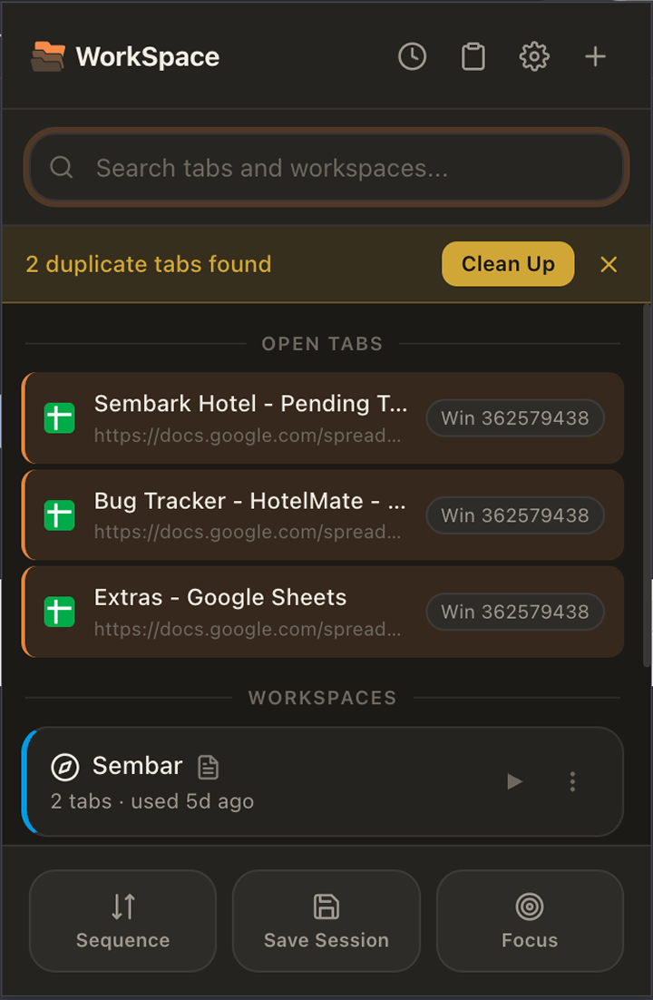

<div align="center">
  
  <h1>WorkSpace</h1>
  <p><strong>Focus-mode tab & workspace manager for Chrome</strong></p>
  <p>
    
    
    
    
  </p>
</div>

---

WorkSpace is a Chrome extension that helps you **organize open tabs into named workspaces**, eliminate distractions with a dedicated Focus Mode, track time spent on domains, and keep a quick-access scratchpad — all from a single popup.

## Features

### Workspaces
- Create named workspaces with a custom icon and color
- Launch a workspace to open its saved URLs in the current or a new window
- Optionally auto-close unrelated tabs on launch
- Optionally auto-group launched tabs using Chrome Tab Groups
- Duplicate, edit, or delete any workspace via right-click context menu
- Drag-and-drop reordering of workspaces

### Focus Mode
- One-click toggle to enter a distraction-free environment
- Automatically opens a designated "focus workspace"
- Optionally closes all unrelated tabs or launches in a new window
- Visual badge indicator on the extension icon while active

### Duplicate Tab Detection
- Real-time detection of duplicate tabs across the window
- Banner notification with one-click "Clean Up"
- Option to ignore `#hash` fragments when comparing URLs
- Badge on the extension icon showing the duplicate count

### Tab Sequencer
- Re-orders open tabs by domain frequency with a single click
- Supports custom regex rules to define a preferred tab order
- Regex rules configurable from Settings → Advanced

### Time Tracker
- Silently records active time per domain for the current day and week
- Configurable idle threshold (pauses when the system is idle)
- Today / This Week toggle in the Time Tracker view

### Scratchpad
- Lightweight clipboard for URLs you don't want to lose
- Paste multiple URLs at once or add the current tab with one click
- Open all scratchpad URLs or save them directly as a new workspace

### Session Saver
- Save all currently open tabs as a new workspace instantly

### Search
- Fuzzy search across workspaces and open tabs from the popup

## Screenshots

<div align="center">
  
  &nbsp;&nbsp;
  
  &nbsp;&nbsp;
  
</div>

| Light mode | Dark mode | Empty state |
|:---:|:---:|:---:|
| Duplicate banner, open tabs, workspace list | Full dark theme with warm tones | First-run onboarding with feature discovery |

## Installation

1. Clone or download this repository.
2. Open Chrome and navigate to `chrome://extensions`.
3. Enable **Developer Mode** (toggle in the top-right corner).
4. Click **Load unpacked** and select the repository folder.
5. The WorkSpace icon will appear in your toolbar.

## Keyboard Shortcuts

| Action | Default shortcut |
|---|---|
| Open popup | `Ctrl+Shift+W` / `Cmd+Shift+W` |
| Open workspace switcher | Unassigned (set in Chrome) |
| Toggle Focus Mode | Unassigned (set in Chrome) |

To assign or change shortcuts: `chrome://extensions/shortcuts`

## Settings

All settings are accessible via the gear icon in the popup or `chrome://extensions` → WorkSpace → Extension options.

| Section | Options |
|---|---|
| **General** | Theme (system / light / dark), default launch mode, icon display, last-used timestamps, close confirmation, duplicate detection |
| **Focus Mode** | Focus workspace, close other tabs, open in new window |
| **Tab Groups** | Default group color, auto-group on launch, group name format |
| **Advanced** | Time Tracker toggle, idle threshold, tab sequence regex rules |
| **Data** | Export / import workspaces as JSON, reset settings, delete all workspaces |

## Project Structure

```
WorkSpace.Ex/
├── manifest.json        # Extension manifest (MV3)
├── background.js        # Service worker — focus mode, badge, tab events
├── popup.html/.js/.css  # Main popup UI
├── settings.html/.js/.css # Options page
└── icons/               # Extension icons (16, 48, 128 px)
```

## Tech Stack

- **Manifest V3** service worker architecture
- Vanilla JS — no frameworks or build step required
- Chrome Extension APIs: `tabs`, `tabGroups`, `storage`, `windows`, `scripting`, `idle`, `alarms`, `contextMenus`

## Author

**Soham Shirsat** — [GitHub](https://github.com/Kripasindhu) 

---

_Built as a personal productivity tool and portfolio project._
